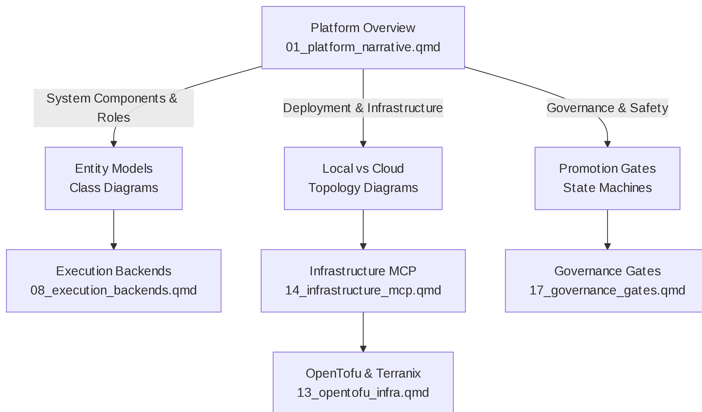
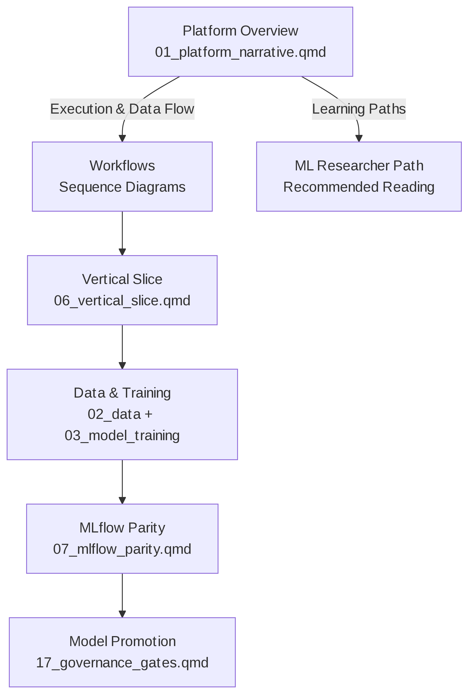

# ML Deploy Reference

# Welcome to the ML Deployment Reference

This documentation provides a **self-contained, specification-driven
guide** to the ML deployment platform. All diagrams, code examples, and
infrastructure definitions are published directly in these pages—**no
repository source browsing required**.

## Reading Guide

The platform documentation is organized around a **Platform Overview**
with five logical subsections. Choose your entry point based on your
role:

### For Infrastructure & Operations Engineers

Start with system components, then dive into deployment and
infrastructure:

<figure class=''>

</figure>

**Recommended path:** 1. [Platform Overview — System
Components](01_platform_narrative.qmd#1-system-components--roles) 2.
[Platform Overview — Deployment &
Infrastructure](01_platform_narrative.qmd#3-deployment--infrastructure)
3. [Execution Backends](04_01-execution_framework.qmd) 4.
[Infrastructure MCP](03_02-infrastructure_management.qmd) 5. [OpenTofu &
Terranix](03_01-infrastructure_as_code.qmd)

### For Data Scientists & ML Researchers

Start with platform architecture, then focus on model development and
promotion:

<figure class=''>

</figure>

**Recommended path:** 1. [Platform Overview — Execution & Data
Flow](01_platform_narrative.qmd#2-execution--data-flow) 2. [Vertical
Slice Reference](02_04-complete_workflow.qmd) 3. [Data & Model
Training](02_01-data_management.qmd) + [Model
Training](02_02-model_development.qmd) 4. [MLflow Parity
Setup](02_03-mlflow_integration.qmd) 5. [Model Promotion &
Governance](04_05-governance_framework.qmd)

------------------------------------------------------------------------

## Foundations

- [Stack introduction](01_02-platform_introduction.qmd)
- [Platform narrative](01_03-platform_architecture.qmd)
- [Core module baseline](01_04-core_concepts.qmd)

## Lifecycle notebooks

- [Data loading and exploration](02_01-data_management.qmd)
- [Model training](02_02-model_development.qmd)
- [Web UI reference context](04_04-user_interfaces.qmd)
- [Vertical slice reference](02_04-complete_workflow.qmd)
- [Web UI contracts](04_03-api_contracts.qmd)

## Topology and operations notebooks

- [MLflow parity](02_03-mlflow_integration.qmd)
- [Infrastructure MCP
  interrogation](03_02-infrastructure_management.qmd)
- [Execution backends](04_01-execution_framework.qmd)
- [Notebook intake validation](04_02-notebook_management.qmd)

## Architecture analysis

- [System interaction analysis](05_01-system_architecture.qmd)
- [OpenTofu infrastructure
  architecture](03_01-infrastructure_as_code.qmd)
- [Floci AWS emulator](03_03-local_development.qmd)
- [Terranix infrastructure source](03_04-terraniq_integration.qmd)

------------------------------------------------------------------------

## Quick Start

### Option 1: I want to understand the system (5 min)

→ Read [Platform Overview](01_03-platform_architecture.qmd) sections 1–3

### Option 2: I want to set up local development (15 min)

→ [MLflow Parity](02_03-mlflow_integration.qmd) + [Execution
Backends](04_01-execution_framework.qmd)

### Option 3: I want to run a complete example (20 min)

→ [Vertical Slice Reference](02_04-complete_workflow.qmd)

### Option 4: I want to deploy to production (30 min)

→ [OpenTofu & Terranix](03_01-infrastructure_as_code.qmd) + [Governance
Gates](04_05-governance_framework.qmd)

------------------------------------------------------------------------

## Navigation Tips

- **All diagrams are in Mermaid format** — Rendered directly in the
  pages
- **All code examples are copy-pastable** — No need to hunt in the
  repository
- **Cross-links connect related sections** — Use them to navigate by
  topic
- **Learning paths are role-specific** — Choose the path that matches
  your background

------------------------------------------------------------------------

## Key Principles

1.  **Self-contained documentation**: Implement the system from these
    pages alone
2.  **Hierarchical structure**: Start broad (architecture), then dive
    deep (details)
3.  **Extensive diagramming**: Class, sequence, state machine, and
    topology diagrams for each subsection
4.  **Spec-driven**: All behavior is specified first, then implemented
5.  **Traceability**: MLflow links all training to promotion workflows
