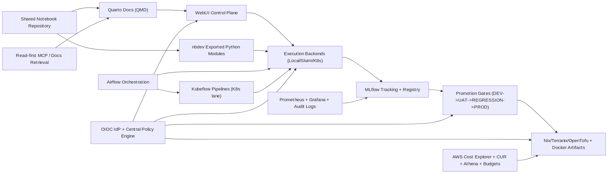

# Stack Introduction

# Introduction

This page is the front door for MLOps engineers joining the project. It
starts with the purpose of the repository, then builds up from the
broadest architectural principles into the concrete stack and runtime
topology.

## Purpose

The repository exists to guide ML engineers through a complete,
specification-first MLOps reference system: how to author it, how to
govern it, how to run it locally or in cloud, and how to promote both
models and platform changes safely.

## System-at-a-glance

The repository is a specification-first, documentation-first ML
deployment guide with executable reference modules. It combines:

- **Purpose and governance** through explicit policy gates and
  contract-driven workflows.
- **Canonical authoring workflow** through nbdev + Quarto/QMD for ML
  researchers and architecture writers.
- **Centralized authorization** through OIDC-backed identity and
  policy-driven capability validation.
- **WebUI-first operations** for triggering notebook execution and
  monitoring run state.
- **Notebook-owned implementation modules** exported through nbdev.
- **Shared notebook source repository** used by both local emulation and
  cloud profiles.
- **Local/cloud parity** for infrastructure and runtime wiring.
- **Traceable ML lifecycle** through MLflow and stage-based promotion
  gates.
- **MLOps promotion control** for Nix/Terranix/OpenTofu
  system-definition changes.
- **Security, observability, and cost visibility** as first-class
  cross-cutting concerns.

## Software stack summary

The stack below is ordered from the most structuring choices to the most
implementation-local ones.

### Infrastructure and Governance

- **Authorization**: OIDC IdP + Policy Engine for role management
- **Promotion Gates**: Model Artifacts + MLOps for
  DEV→UAT→REGRESSION→PROD approvals
- **Infrastructure**: Nix + Terranix for Docker/Compose/OpenTofu
  artifacts

### Development and Workflow

- **Package/Module**: nbdev + Quarto for ML-researcher workflow
- **Python**: uv2nix + uv for Nix-controlled dependencies
- **Documentation**: Quarto + Mermaid for publishable architecture docs

### Execution and Monitoring

- **Web Control**: WebUI + Contracts for execution and monitoring
- **Notebooks**: Shared Repository for local/cloud common source
- **Orchestration**: Airflow for pipeline workflows
- **Kubernetes**: Kubeflow (optional) for K8s ML pipeline layer

### Data and Tracking

- **Tracking**: MLflow for run metadata and models
- **Lineage**: MLflow Metadata for data training traceability
- **Execution**: Local/Slurm/K8s for compute routing
- **Storage**: PostgreSQL + S3 for tracking and artifacts

### Local Environment

- **Local Emulation**: Docker + Floci + K3s for local compute
- **Observability**: Prometheus + Grafana for metrics and telemetry
- **Cost Visibility**: AWS Tools for spend reporting

### Quality and Access

- **Assistants**: Read-first + MCP for controlled access to facts
- **Runtime**: Python 3.13 for implementation modules
- **CI Gate**: GitHub Actions for export and testing
- **Validation**: unittest suite for contract and freshness checks

TODO: reorder the table rows in order of importance (what is most
structuring to the whoe rpoject to the least) TODO: Python+uv:2~Should
use uv2nix as to minimise the use of environments not reproducible
and/or controled by Nix. TODO: nbdev / qmd:2~nbdev is the way ML
researcher control they workflow (along with the MLflow and/or webUI
interface). qmd is aspirationally the way to control the Nix-driven
architecture.

TODO: The order of the description needs improving. General to specifics
to show how to fit pieces together.

## Local/cloud topology

1.  **Local emulation profile**: Docker Compose services for MLflow,
    PostgreSQL, Floci, Traefik, and local compute services (K3s +
    Slurm).
2.  **Cloud profile**: AWS-hosted services with Traefik-fronted MLflow,
    PostgreSQL and S3-backed artifacts, and scheduler-integrated
    execution pathways.
3.  **Generated artifacts**: Nix/Terranix is the canonical source that
    generates Docker, Docker Compose, and OpenTofu JSON artifacts.
4.  **Kubeflow placement**: Kubeflow Pipelines sits in the Kubernetes
    execution lane; it is optional and complements Airflow orchestration
    rather than replacing Slurm-based paths.
5.  **Local testing/emulation**: Kubeflow can run locally on K3s for
    workflow testing and parity checks before cloud rollout.
6.  **Security and governance**: OIDC-backed identity plus a centralized
    policy engine governs roles, capabilities, audit, and request
    validation across systems and subsystems.
7.  **MLOps promotion**: model artifacts and MLOps system-definition
    changes both use DEV→UAT→REGRESSION→PROD promotion gates.
8.  **Assistant access**: infrastructure and documentation assistants
    stay read-first, least-privilege, and auditable.

## Lifecycle flow

<figure class=''>

</figure>

## Where to go next

- Platform architecture narrative:
  [`01_platform_narrative.qmd`](01_03-platform_architecture.qmd)
- Runtime and orchestration modules:
  [`07_mlflow_parity.qmd`](02_03-mlflow_integration.qmd),
  [`08_execution_backends.qmd`](04_01-execution_framework.qmd),
  [`14_infrastructure_mcp.qmd`](03_02-infrastructure_management.qmd)
- Governance and promotion gates:
  [`17_governance_gates.qmd`](04_05-governance_framework.qmd)
