# Platform Narrative

# Platform Overview

The ML model deployment platform provides a specification-first,
notebook-driven foundation for training, promotion, and
infrastructure-as-code governance. The system prioritizes self-contained
documentation, traceability through MLflow, and local-to-cloud parity
for infrastructure and operations.

## Platform architecture

The platform is organized into five core domains:

1.  **System Components & Roles** — Core entities (Repository,
    DocumentationSeries, MLflow, OpenTofu) and their relationships
2.  **Execution & Data Flow** — Workflows (notebook execution, model
    promotion, artifact tracking) and state machines
3.  **Deployment & Infrastructure** — Local emulation and cloud topology
    with parity constraints
4.  **Governance & Safety** — Promotion gates and spec-first safety
    controls
5.  **Learning Paths** — Role-specific reading guides for engineers and
    researchers

See detailed breakdowns below.

------------------------------------------------------------------------

## 1. System Components & Roles

### Core Entities

The platform’s architecture is built on five core entities and their
relationships:

- **Repository**: The root scope; manages phases (specification_first
  vs. implementation_enabled), tracks deployment profiles, and
  orchestrates CI/CD.
- **DocumentationSeries**: Self-contained, hierarchical docs that serve
  as the source of truth for system behavior.
- **OpenTofuConfiguration**: Infrastructure-as-code generated by
  Nix/Terranix; supports both local emulation and cloud deployment
  profiles.
- **MLflowTrackingServer**: Centralized model and experiment tracking
  with PostgreSQL backend and S3/Floci artifact store.
- **ModelArtifact**: Versioned model packages with promotion gates (DEV
  → UAT → REGRESSION → PROD).
- **PromotionStage**: Discrete approval and quality gate levels for
  production safety.

### Entity Relationships and Responsibilities

This introduction-level narrative intentionally keeps entity
relationships concise. For the full relationship map and
responsibility-level structure, see
[`12_system_interaction_analysis.qmd`](05_01-system_architecture.qmd).

### Component Interaction Overview

The system orchestrates seven interaction domains:

1.  **Notebook Intake**: Immutable qmd/ipynb sources with export guards
2.  **Execution Dispatch**: Route to local, Slurm, or Kubernetes
    executors
3.  **MLflow Traceability**: Track params, metrics, artifacts, model
    versions
4.  **Data Lineage**: Link datasets, transformations, features, model
    artifacts, and promotion events end-to-end
5.  **Artifact Management**: Package, version, and store trained models
6.  **Security & Capability Validation**: Enforce role/capability checks
    for data access, model operations, local/cloud execution,
    infrastructure changes, and promotion actions
7.  **Promotion & Governance**: Apply gates, approvals, and quality
    checks before production

------------------------------------------------------------------------

## 2. Execution & Data Flow

### Key Workflows

The platform implements four primary workflows, each with distinct
decision points and state transitions:

#### A. Notebook Execution Workflow (EX-01)

<figure class=''>

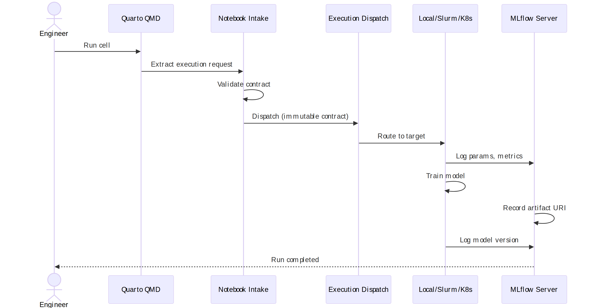

</figure>

#### B. Model Promotion Workflow (EX-02 → EX-03)

<figure class=''>

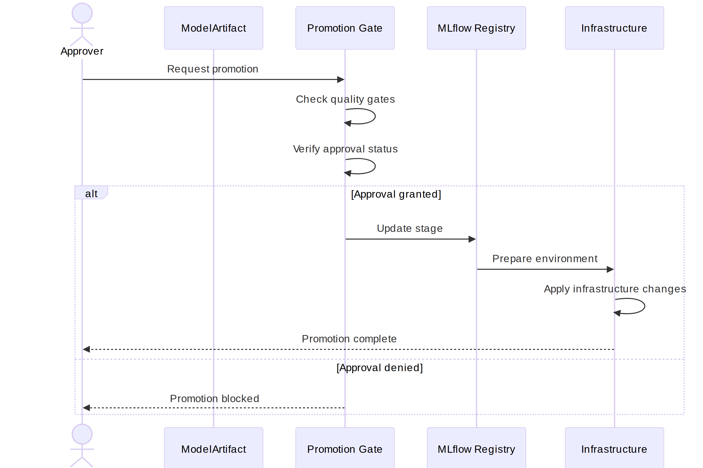

</figure>

#### C. Artifact Tracking Workflow

<figure class=''>

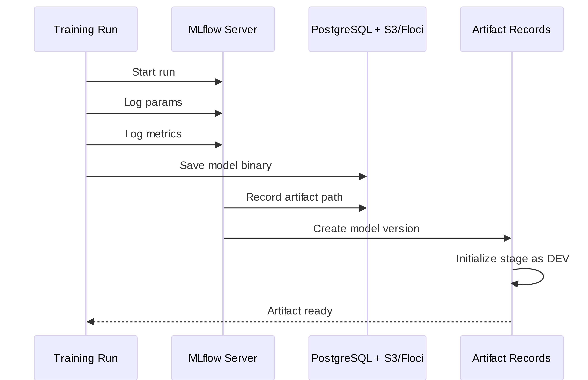

</figure>

### State Machines

#### Repository Governance Phase Machine

<figure class=''>

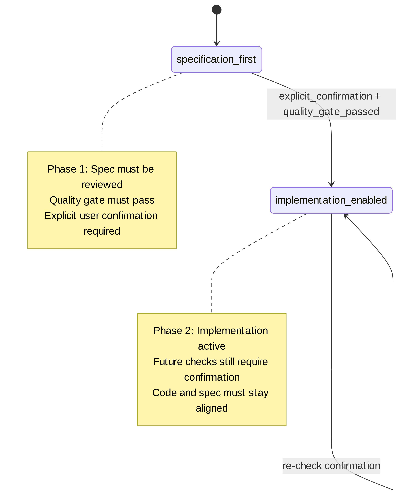

</figure>

#### Model Promotion State Machine

<figure class=''>

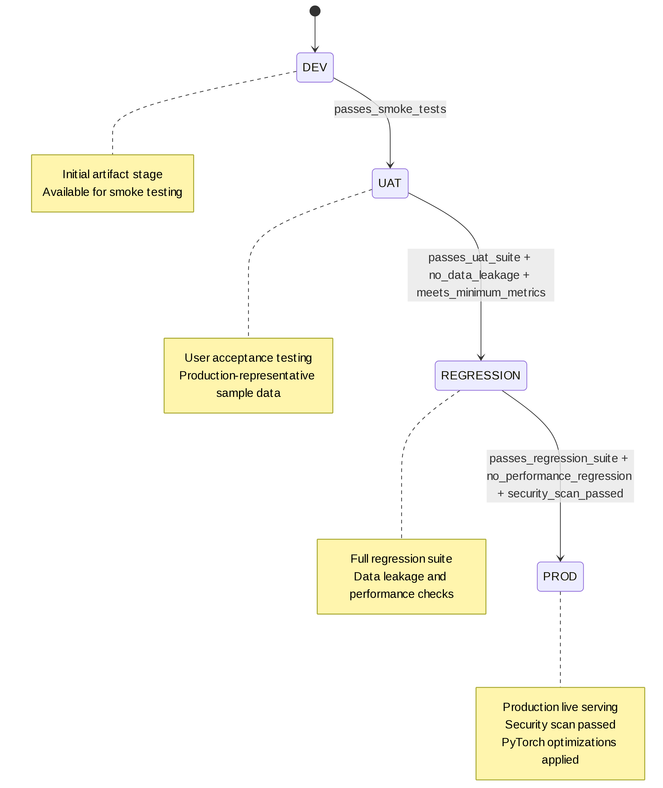

</figure>

------------------------------------------------------------------------

## 3. Deployment & Infrastructure

### Local Emulation Stack

The local development environment mirrors production infrastructure
using Docker Compose:

<figure class=''>

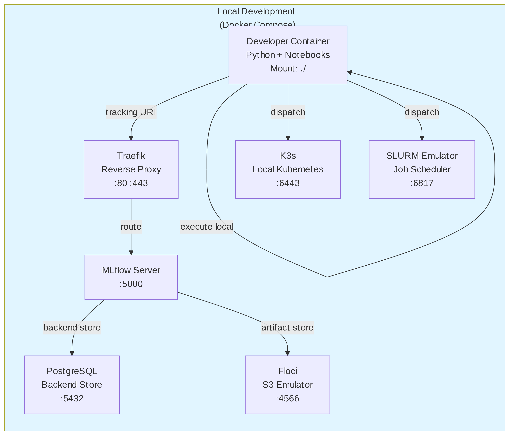

</figure>

### Cloud Deployment Topology

Production deployment uses AWS managed services with Kubernetes
orchestration:

<figure class=''>

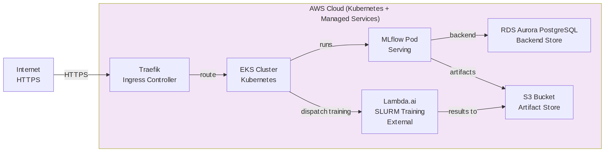

</figure>

### Infrastructure Parity Constraints

Local and cloud deployments must maintain parity across:

### Component Parity

- **Reverse Proxy**: Traefik Docker (local) vs Traefik K8s Ingress
  (cloud) - Same routing rules
- **Backend Store**: PostgreSQL Docker (local) vs RDS Aurora PostgreSQL
  (cloud) - Same schema, connection pool
- **Artifact Store**: Floci S3 (local) vs AWS S3 (cloud) - Same S3 API
  surface
- **Compute**: Local + Docker + K3s + SLURM (local) vs EKS + Lambda.ai
  SLURM (cloud) - Contract-driven dispatch

------------------------------------------------------------------------

## 4. Governance & Safety

### Promotion Gate Architecture

Model promotion requires passing progressive quality gates:

<figure class=''>

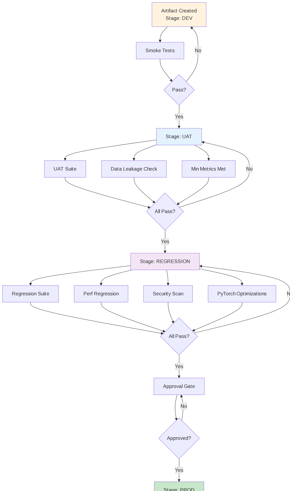

</figure>

### Spec-First Governance

The repository lifecycle enforces specification-first principles:

<figure class=''>

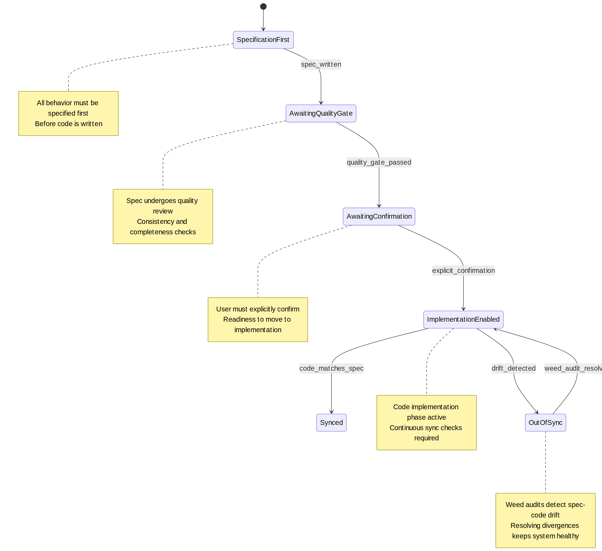

</figure>

------------------------------------------------------------------------

## 5. Learning Paths

### Software Engineer Learning Path

Engineers focused on infrastructure, deployment, and operations should
follow this progression:

<figure class=''>

</figure>

### ML Researcher Learning Path

Researchers focused on model development, training, and promotion should
follow this progression:

<figure class=''>

</figure>

------------------------------------------------------------------------

## Implementation steps

1.  **Validate contracts** — Immutable notebook intake and execution
    request structure
2.  **Route execution** — Dispatch through local, Slurm, or Kubernetes
    adapters
3.  **Record traceability** — Link all outcomes to MLflow runs and
    artifact records
4.  **Apply gates** — Enforce promotion stage transitions with quality
    checks
5.  **Verify parity** — Ensure local emulation and cloud deployment
    remain synchronized

## Trade-offs

- **Notebook-first workflows** improve discoverability but require
  strict immutability and export guards
- **Local emulation** reduces cloud-risk iteration cost but cannot fully
  replicate all production failure modes
- **Spec-first governance** improves consistency but can lag
  implementation if drift checks are skipped
- **Extensive diagramming** aids comprehension but requires ongoing
  maintenance as the system evolves

## Security considerations

- Keep MCP integrations read-first and least-privilege by default
- Enforce immutable notebook references for all execution
- Treat cloud deployment credentials and runtime secrets as externally
  managed inputs
- Model version source validation must be enabled in production (S3 URI
  regex constraints)
- All MLflow tracking must use secure backend store connections

## Examples of use

- **Local reference slice execution**: Run the vertical slice example
  with MLflow-linked run visibility
- **Backend payload mapping**: Submit training jobs to Slurm/Kubernetes
  with normalized request contracts
- **Notebook intake validation**: Parse and validate immutable execution
  contracts before dispatch
- **Promotion workflow**: Move models through DEV → UAT → REGRESSION →
  PROD with gate enforcement

## Software engineer learning path

Engineers focused on infrastructure, deployment, and operations should
follow this progression:

<figure class=''>

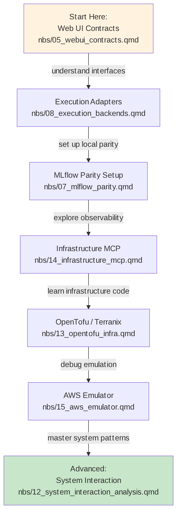

</figure>

## ML researcher learning path

Researchers focused on model development, training, and promotion should
follow this progression:

<figure class=''>

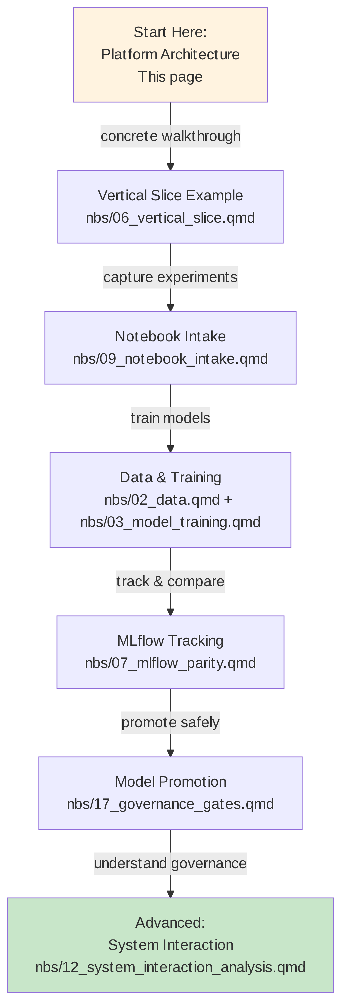

</figure>

------------------------------------------------------------------------

## Cross-Cutting Concepts

### High-Level Introduction

This platform serves hedge-fund ML engineers who require:

1.  **Discoverability**: Self-contained documentation that doesn’t
    require repository browsing
2.  **Reproducibility**: Immutable notebook execution contracts backed
    by spec-first governance
3.  **Traceability**: Complete MLflow linkage from training through
    promotion
4.  **Parity**: Local emulation that mirrors production infrastructure
    and behavior
5.  **Safety**: Progressive promotion gates with quality checks and
    approvals
