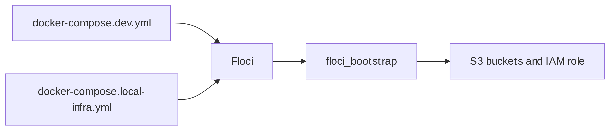

# Floci AWS Emulator


This page is the copy-pasteable source for the shared local AWS
emulator. It replaces the earlier LocalStack/MinIO split and is the only
local AWS emulator the repo now treats as canonical.

<div>

<figure class=''>

<div>



</div>

</figure>

</div>

## Compose file

``` yaml
services:
  floci:
    image: floci/floci:latest
    container_name: ml_deploy_floci
    user: root
    networks:
      - ml_local
    ports:
      - "4566:4566"
    environment:
      FLOCI_HOSTNAME: floci
      FLOCI_STORAGE_MODE: persistent
      AWS_DEFAULT_REGION: us-east-1
    volumes:
      - /var/run/docker.sock:/var/run/docker.sock
      - floci_data:/var/lib/floci
    healthcheck:
      test: ["CMD", "curl", "-f", "http://localhost:4566/_localstack/health"]
      interval: 15s
      timeout: 10s
      retries: 5
      start_period: 20s

  floci_bootstrap:
    image: amazon/aws-cli:2.15.56
    container_name: ml_deploy_floci_bootstrap
    depends_on:
      floci:
        condition: service_healthy
    networks:
      - ml_local
    environment:
      AWS_ACCESS_KEY_ID: test
      AWS_SECRET_ACCESS_KEY: test
      AWS_DEFAULT_REGION: us-east-1
      AWS_ENDPOINT_URL: http://floci:4566
    entrypoint: ["/bin/sh", "-c"]
    command:
      - |
        echo "Initialising Floci buckets and roles..."
        aws s3 mb s3://mlflow-artifacts --endpoint-url=http://floci:4566 || true
        aws s3 mb s3://model-registry --endpoint-url=http://floci:4566 || true
        aws iam create-role \
          --role-name ml-deploy-local \
          --assume-role-policy-document '{"Version":"2012-10-17","Statement":[{"Effect":"Allow","Principal":{"Service":"ec2.amazonaws.com"},"Action":"sts:AssumeRole"}]}' \
          --endpoint-url=http://floci:4566 || true
        echo "Floci init complete."

volumes:
  floci_data:

networks:
  ml_local:
    name: ml_local
    driver: bridge
```

## Run order

1.  Start this file first.
2.  Start `docker-compose.dev.yml` for MLflow/PostgreSQL.
3.  Start `docker-compose.local-infra.yml` for K3s and Slurm.
