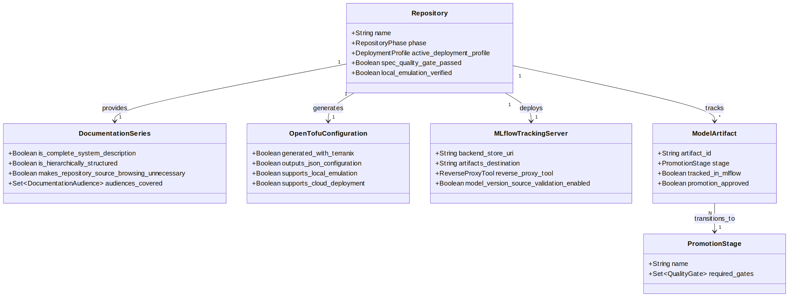

# System Interaction Analysis

This page captures the five-layer interaction analysis used to reason
about boundaries and coupling:

1.  **Context layer** — actors, external systems, and trust boundaries.
2.  **Component layer** — implementation modules and ownership.
3.  **Contract layer** — invariant and interface obligations.
4.  **Flow layer** — control, data, and artifact movement.
5.  **Operations layer** — observability, cost, failure handling, and
    governance.

## Interaction checkpoints

- Request normalization and immutable notebook revision validation.
- Execution target routing (local, Slurm, Kubernetes).
- MLflow-linked run visibility and traceability.
- Artifact and deployment record integrity.
- Infrastructure parity and MCP interrogation readiness.

## Detailed entity relationships and responsibilities

This page carries the detailed entity relationship map that was removed
from the top-level narrative to keep the introduction focused.

<figure class=''>

</figure>

