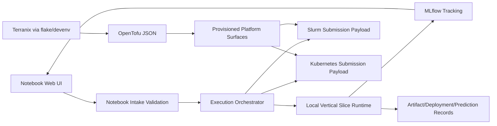

# Full system interaction analysis

## Purpose

Provide a higher-order architecture analysis that explicitly maps **what each component is**, **how components interact**, **where coupling exists**, and **which controls reduce risk**.

This page mirrors and indexes the canonical notebook notes in:

- `nbs/12_system_interaction_analysis.qmd`

## Layered analysis model

### 1. System context

- Actors: ML engineer, platform engineer, reviewer/governance owner.
- External systems: Git, MLflow, PostgreSQL/S3-compatible storage, Slurm, Kubernetes.
- Boundary principle: platform behavior is defined by explicit contracts and traceability, not platform-specific hidden assumptions.

### 2. Component architecture

- Notebook intake validates immutable notebook revision + request structure.
- Execution orchestrator is the normalization and routing hub.
- Vertical-slice runtime emits the reference traceability chain.
- MLflow parity config resolves storage/tracking contract settings.
- Nix/Terranix infra generation emits OpenTofu JSON for reproducible infrastructure definitions.

### 3. Interaction contracts

- Canonical chain: request -> normalize -> route -> execute/submit -> traceability records -> run visibility.
- Core invariants:
  - immutable revision execution
  - model/deployment/prediction traceability continuity
  - convergent flake/devenv infra semantics at OpenTofu JSON output.

### 4. Execution flows

- Local path is end-to-end executable and already contract-tested.
- Slurm/Kubernetes paths currently emit stable submission payloads and require live client adapters for execution/status loops.
- Retry/rollback expectations are defined as lifecycle semantics anchored by immutable request/run/deployment identifiers.

### 5. Operational coupling

- Observability: MLflow run links are the primary pivot surface.
- Security: immutable source refs + runtime secret injection + environment-specific least privilege.
- Cost: enforce environment/workload tagging and attribution continuity at submission boundaries.
- Deployment: parity between local and remote lifecycle semantics remains a key design guardrail.

## Component interaction graph

## Highest-priority risks and controls

| Risk | Why it matters | Control |
| --- | --- | --- |
| Divergent backend payload semantics | breaks environment portability | contract tests over normalized job spec and backend maps |
| Traceability drift across environments | weakens auditability and incident response | mandatory lineage fields across run/deploy/predict records |
| flake/devenv config divergence | non-reproducible infrastructure behavior | parity tests over generated OpenTofu JSON outputs |
| hidden secret handling | security and governance failure | runtime-only secret injection contract, immutable notebook execution |
| scheduler failures without lifecycle states | operational blind spots | explicit submission state model (submitted/running/failed/finished) |

## Implementation-facing guidance

1. Keep orchestration normalization as the single routing boundary.
2. Add scheduler clients as adapters beneath existing contracts, not as new request models.
3. Treat OpenTofu JSON generation as a testable artifact interface.
4. Preserve traceability continuity as a hard non-functional requirement.
5. Keep observability/security/cost semantics attached to execution contracts from day one.
