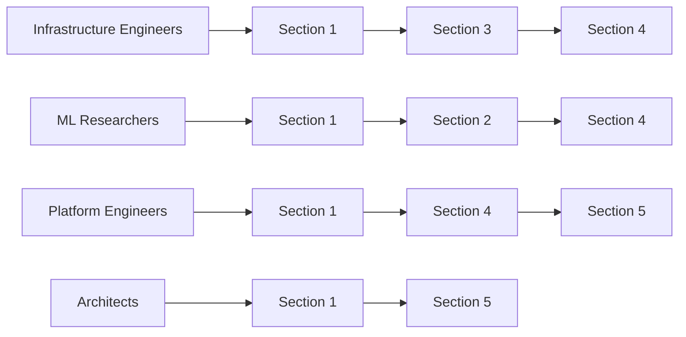

# Decision: Quarto Documentation Restructure

**What this page is for**: Decision record specifying the comprehensive restructure of Quarto documentation files into logical sections with improved navigation, user experience, and progressive learning paths.

**When to read**: When organizing documentation structure, implementing the restructure, or understanding the new navigation system.

**Upstream spec**: Documentation requirements from AGENTS.md and repository standards

---

## Decision

### Documentation Restructure Plan: 5 Logical Sections

**IMPLEMENTATION PLAN**: Restructure the existing 17+ Quarto files into 5 logical sections with progressive navigation and role-specific learning paths.

#### Current Structure Analysis

**Current Issues:**

1. **Scattered Content**: 17+ qmd files spread across directory without clear grouping
2. **Poor Navigation**: No clear section hierarchy or progressive learning path
3. **Mixed Audiences**: Both infrastructure engineers and ML researchers mixed together
4. **Missing Context**: Some pages assume knowledge that hasn't been established yet
5. **Redundant Information**: Similar concepts covered in multiple places

**Current Files:**

- `index.qmd` - Landing page
- `00_introduction.qmd` - Stack introduction
- `01_platform_narrative.qmd` - Platform overview
- `00_core.qmd` - Core module baseline
- `02_data.qmd` - Data loading
- `03_model_training.qmd` - Model training
- `04_web_ui.qmd` - Web UI reference
- `05_webui_contracts.qmd` - Web UI contracts
- `06_vertical_slice.qmd` - Vertical slice
- `07_mlflow_parity.qmd` - MLflow parity
- `08_execution_backends.qmd` - Execution backends
- `09_notebook_intake.qmd` - Notebook intake
- `12_system_interaction_analysis.qmd` - System interaction analysis
- `13_opentofu_infra.qmd` - OpenTofu infrastructure
- `14_infrastructure_mcp.qmd` - Infrastructure MCP
- `15_aws_emulator.qmd` - AWS emulator
- `16_terranix_infra.qmd` - Terranix infrastructure
- `17_governance_gates.qmd` - Governance gates

#### New Structure: 5 Logical Sections

```mermaid
graph TD
    A[Section 1: Platform Overview & Foundations] --> B[01_getting_started.qmd]
    A --> C[02_platform_introduction.qmd]
    A --> D[03_platform_architecture.qmd]
    A --> E[04_core_concepts.qmd]

    F[Section 2: ML Development Lifecycle] --> G[05_data_management.qmd]
    F --> H[06_model_development.qmd]
    F --> I[07_mlflow_integration.qmd]
    F --> J[08_complete_workflow.qmd]

    K[Section 3: Infrastructure & Operations] --> L[09_infrastructure_as_code.qmd]
    K --> M[10_infrastructure_management.qmd]
    K --> N[11_local_development.qmd]
    K --> O[12_terraniq_integration.qmd]

    P[Section 4: System Integration & Governance] --> Q[13_execution_framework.qmd]
    P --> R[14_notebook_management.qmd]
    P --> S[15_api_contracts.qmd]
    P --> T[16_user_interfaces.qmd]
    P --> U[17_governance_framework.qmd]

    V[Section 5: Architecture & Design] --> W[18_system_architecture.qmd]
```

#### Section 1: Platform Overview & Foundations

**Purpose**: High-level system introduction and conceptual foundation
**Target Audience**: Everyone, especially new team members
**Navigation Path**: 01 → 02 → 03 → 04

**Files**:

- `01_getting_started.qmd` (NEW) - Comprehensive navigation and quick start guide
- `02_platform_introduction.qmd` (renamed from `00_introduction.qmd`) - High-level system overview
- `03_platform_architecture.qmd` (renamed from `01_platform_narrative.qmd`) - System components and relationships
- `04_core_concepts.qmd` (renamed from `00_core.qmd`) - Essential terminology and patterns

#### Section 2: ML Development Lifecycle

**Purpose**: End-to-end ML workflow from data to deployment
**Target Audience**: Data Scientists, ML Researchers
**Navigation Path**: 05 → 06 → 07 → 08

**Files**:

- `05_data_management.qmd` (renamed from `02_data.qmd`) - Data loading and exploration
- `06_model_development.qmd` (renamed from `03_model_training.qmd`) - Training and experimentation
- `07_mlflow_integration.qmd` (renamed from `07_mlflow_parity.qmd`) - Experiment tracking
- `08_complete_workflow.qmd` (renamed from `06_vertical_slice.qmd`) - End-to-end example

#### Section 3: Infrastructure & Operations

**Purpose**: Infrastructure setup, deployment, and operational aspects
**Target Audience**: Infrastructure Engineers, DevOps
**Navigation Path**: 09 → 10 → 11 → 12

**Files**:

- `09_infrastructure_as_code.qmd` (renamed from `13_opentofu_infra.qmd`) - Terranix/OpenTofu setup
- `10_infrastructure_management.qmd` (renamed from `14_infrastructure_mcp.qmd`) - Operational monitoring
- `11_local_development.qmd` (renamed from `15_aws_emulator.qmd`) - Local development setup
- `12_terraniq_integration.qmd` (renamed from `16_terranix_infra.qmd`) - Nix-based infrastructure

#### Section 4: System Integration & Governance

**Purpose**: System interfaces, APIs, and governance mechanisms
**Target Audience**: Platform Engineers, System Architects
**Navigation Path**: 13 → 14 → 15 → 16 → 17

**Files**:

- `13_execution_framework.qmd` (renamed from `08_execution_backends.qmd`) - Backend execution models
- `14_notebook_management.qmd` (renamed from `09_notebook_intake.qmd`) - Intake and validation
- `15_api_contracts.qmd` (renamed from `05_webui_contracts.qmd`) - System interfaces
- `16_user_interfaces.qmd` (renamed from `04_web_ui.qmd`) - Web UI components
- `17_governance_framework.qmd` (renamed from `17_governance_gates.qmd`) - Safety and controls

#### Section 5: Architecture & Design

**Purpose**: Deep technical architecture and design patterns
**Target Audience**: Senior Engineers, Architects
**Navigation Path**: 18

**Files**:

- `18_system_architecture.qmd` (renamed from `12_system_interaction_analysis.qmd`) - Deep technical analysis

#### Navigation Features

**Role-Specific Paths**:

**Progressive Learning Paths**:

1. **Beginner Path**: Section 1 only (understanding the system)
2. **ML Practitioner Path**: Sections 1-2 (development workflows)
3. **Infrastructure Path**: Sections 1, 3-4 (operations and integration)
4. **Complete Path**: All sections 1-5 (comprehensive understanding)

#### Cross-Reference System

**Internal Links**:

- Each section links to prerequisite sections
- Related topics within sections are cross-referenced
- Navigation breadcrumbs show current position

**External Integration**:

- Links to wiki decision records
- Integration with existing repository structure
- Reference to implementation code where relevant

#### Implementation Strategy

**Phase 1: Structure Creation**

1. Create new `01_getting_started.qmd` as comprehensive navigation
2. Rename existing files to new structure
3. Update all internal links
4. Create section overview pages

**Phase 2: Content Enhancement**

1. Add navigation breadcrumbs to each file
2. Create role-specific reading guides
3. Add progress indicators for each section
4. Enhance cross-references

**Phase 3: User Experience**

1. Add search functionality
2. Create downloadable PDF versions
3. Add interactive elements where beneficial
4. Implement feedback mechanisms

### Acceptance Criteria

1. **Logical Grouping**: All 17+ files organized into 5 clear sections
2. **Progressive Navigation**: Clear dependencies between sections
3. **Role-Specific Paths**: Multiple navigation paths for different audiences
4. **Cross-References**: Comprehensive internal linking system
5. **User Experience**: Intuitive navigation and clear information hierarchy
6. **Maintainability**: Easy to add new content and update existing content
7. **Documentation Integration**: Links to wiki decision records and implementation

### Related Decisions

- [AGENTS.md](../../../AGENTS.md) - Documentation maintenance workflow
- [Project Scope and Constraints](../decisions/project-scope-and-constraints.md) - Overall documentation standards
- [Documentation Delivery Decision](../decisions/documentation-delivery-decision.md) - Documentation delivery posture

### Open Items

- Specific naming conventions for new files
- Integration with existing CI/CD for documentation builds
- Performance optimization for large documentation sets
- Accessibility requirements for documentation
- Internationalization support if needed

---

## Rationale

### Why This Restructure?

1. **Improved Navigation**: Logical grouping makes it easier to find relevant content
2. **Progressive Learning**: Clear dependencies build knowledge systematically
3. **Role-Specific Content**: Tailored paths for different team members
4. **Reduced Complexity**: Simplified information hierarchy
5. **Better Maintainability**: Clear structure makes updates easier

### Why 5 Sections?

1. **Comprehensive Coverage**: All aspects of ML deployment included
2. **Logical Grouping**: Related content grouped together
3. **Progressive Depth**: From foundation to advanced topics
4. **Flexible Navigation**: Multiple paths for different needs
5. **Scalable Structure**: Easy to add new sections or content

### Why Role-Specific Paths?

1. **Relevant Content**: Each role sees only what's relevant to them
2. **Efficient Learning**: Faster onboarding for specific roles
3. **Reduced Overwhelm**: Focus on essential information first
4. **Better Retention**: Context-appropriate content improves understanding

---

## Implementation Notes

### File Migration Strategy

1. Preserve all existing content and functionality
2. Update all internal references to new file names
3. Maintain backward compatibility where possible
4. Preserve git history for file renames

### Content Enhancement

1. Add navigation breadcrumbs to each file
2. Create section overview pages
3. Add progress indicators and completion tracking
4. Enhance cross-references and related content

### Testing and Validation

1. Test navigation paths for different roles
2. Validate cross-references work correctly
3. Ensure search functionality remains effective
4. Get user feedback on new structure

### Maintenance Considerations

1. Document the new structure for future updates
2. Create guidelines for adding new content
3. Implement automation for link validation
4. Establish regular content review processes
