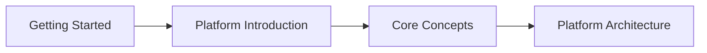
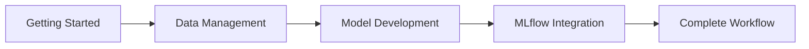
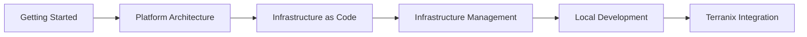

# ML Deployment Reference - Getting Started

Welcome to the comprehensive ML deployment reference platform. This documentation provides a **self-contained, specification-driven guide** to building and operating ML deployment systems with reproducibility, traceability, and production reliability.

## Quick Navigation

Choose your path based on your role and goals:

### 🚀 For New Team Members (5 minutes)
- [Platform Introduction](02_platform_introduction.qmd) - High-level system overview
- [Core Concepts](04_core_concepts.qmd) - Essential terminology and patterns

### 🔬 For ML Researchers & Data Scientists (15-20 minutes)
- [Data Management](05_data_management.qmd) - Data loading and exploration
- [Model Development](06_model_development.qmd) - Training and experimentation
- [MLflow Integration](07_mlflow_integration.qmd) - Experiment tracking
- [Complete Workflow](08_complete_workflow.qmd) - End-to-end example

### ⚙️ For Infrastructure Engineers (30-45 minutes)
- [Platform Architecture](03_platform_architecture.qmd) - System components and relationships
- [Infrastructure as Code](09_infrastructure_as_code.qmd) - Terranix/OpenTofu setup
- [Infrastructure Management](10_infrastructure_management.qmd) - Operational monitoring
- [Terranix Integration](12_terraniq_integration.qmd) - Nix-based infrastructure

### 🏗️ For Platform Engineers (45-60 minutes)
- [Execution Framework](13_execution_framework.qmd) - Backend execution models
- [Notebook Management](14_notebook_management.qmd) - Intake and validation
- [API Contracts](15_api_contracts.qmd) - System interfaces
- [User Interfaces](16_user_interfaces.qmd) - Web UI components
- [Governance Framework](17_governance_framework.qmd) - Safety and controls

### 🎯 For Architects & Senior Engineers (60+ minutes)
- [System Architecture](18_system_architecture.qmd) - Deep technical analysis

## Platform Overview

The ML deployment platform is built on **five core principles**:

1. **Specification-First**: All behavior is specified before implementation
2. **Self-Contained Documentation**: Complete system understanding without repository browsing
3. **Traceability**: End-to-end lineage from data to deployment
4. **Local-Cloud Parity**: Consistent behavior across development and production
5. **Reproducibility**: Deterministic builds and deployments

## Key Architectural Domains

```{mermaid}
graph TD
    A[ML Development Lifecycle] --> B[Data Management]
    A --> C[Model Development]
    A --> D[MLflow Integration]
    A --> E[Complete Workflow]
    
    F[Infrastructure & Operations] --> G[Infrastructure as Code]
    F --> H[Infrastructure Management]
    F --> I[Local Development]
    F --> J[Terranix Integration]
    
    K[System Integration] --> L[Execution Framework]
    K --> M[Notebook Management]
    K --> N[API Contracts]
    K --> O[User Interfaces]
    K --> P[Governance Framework]
    
    Q[Architecture & Design] --> R[System Architecture]
```

## Quick Start Paths

### Path 1: Understanding the System (10 minutes)


### Path 2: Running ML Workflows (30 minutes)


### Path 3: Setting Up Infrastructure (45 minutes)


## Reading Guide

### For Different Roles

#### Infrastructure Engineers
**Focus**: Infrastructure setup, deployment, operations
**Path**: 01 → 03 → 09 → 10 → 11 → 12

#### ML Researchers
**Focus**: Data loading, model training, experiment tracking  
**Path**: 01 → 02 → 05 → 06 → 07 → 08

#### Platform Engineers
**Focus**: System integration, APIs, governance
**Path**: 01 → 03 → 13 → 14 → 15 → 16 → 17

#### System Architects
**Focus**: Deep technical architecture, design patterns
**Path**: 01 → 03 → 18

### For Different Goals

#### Quick Understanding
Read sections from 01 → 02 → 03 → 04

#### Implementation Ready
Read entire sections 1-3 in order

#### Deep Technical Understanding
Read all sections 1-5 in order

## Key Features

### Self-Contained Documentation
- All diagrams rendered directly in pages (Mermaid format)
- All code examples are copy-pastable
- No repository source browsing required
- Cross-linked navigation between related topics

### Progressive Learning
- Each section builds on previous ones
- Clear dependencies and prerequisites
- Multiple learning paths for different audiences
- Practical examples and hands-on guidance

### Production Ready
- Specification-driven approach ensures quality
- Infrastructure as code for reproducible deployments
- Governance framework for production safety
- Comprehensive monitoring and observability

## Next Steps

1. **Choose your path** based on your role above
2. **Start with the first page** in your recommended path
3. **Follow the navigation links** between related topics
4. **Use the examples** to understand practical implementation
5. **Reference the governance framework** for production deployment

---

## Documentation Principles

### 1. Hierarchy First
Each section builds logically on previous content, creating a progressive learning experience.

### 2. Role-Specific Paths
Multiple navigation paths tailored to different team roles and goals.

### 3. Practical Examples
Every concept includes working code examples you can adapt and use.

### 4. Visual Learning
Extensive use of diagrams to illustrate system architecture and workflows.

### 5. Cross-Reference System
Links connect related topics across sections for comprehensive understanding.

---

## Getting Help

If you have questions or need clarification:

1. **Start with the Platform Introduction** for context
2. **Follow the recommended path** for your role
3. **Check the System Architecture** for deep technical details
4. **Review the API Contracts** for integration details

Let's begin your ML deployment journey!