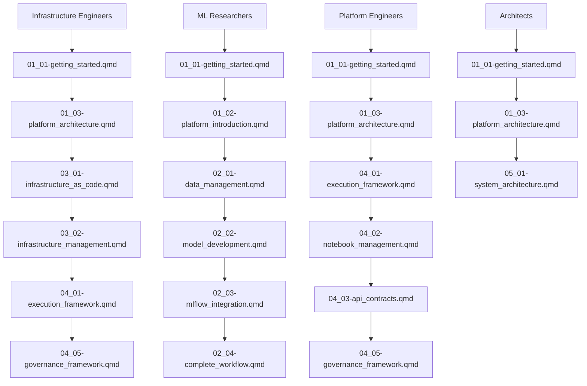

# Qu Documentation Structure

This directory contains the ML deployment reference documentation organized in a hierarchical structure using a section-based numbering system.

## Naming Convention

Files are named using the pattern: `SS_XX-DescriptiveName.qmd`

- **SS**: Section number (01-05)
- **XX**: Position within section (01, 02, 03, etc.)
- **DescriptiveName**: Clear, descriptive name with hyphens

## Section Organization

### Section 1: Platform Overview & Foundations (01\_)

**Purpose**: High-level system introduction and conceptual foundation
**Target Audience**: Everyone, especially new team members

- `01_01-getting_started.qmd` - Comprehensive navigation and quick start guide
- `01_02-platform_introduction.qmd` - High-level system overview
- `01_03-platform_architecture.qmd` - System components and relationships
- `01_04-core_concepts.qmd` - Essential terminology and patterns

### Section 2: ML Development Lifecycle (02\_)

**Purpose**: End-to-end ML workflow from data to deployment
**Target Audience**: Data Scientists, ML Researchers

- `02_01-data_management.qmd` - Data loading and exploration
- `02_02-model_development.qmd` - Training and experimentation
- `02_03-mlflow_integration.qmd` - Experiment tracking
- `02_04-complete_workflow.qmd` - End-to-end example

### Section 3: Infrastructure & Operations (03\_)

**Purpose**: Infrastructure setup, deployment, and operational aspects
**Target Audience**: Infrastructure Engineers, DevOps

- `03_01-infrastructure_as_code.qmd` - Terranix/OpenTofu setup
- `03_02-infrastructure_management.qmd` - Operational monitoring
- `03_03-local_development.qmd` - Local development setup
- `03_04-terraniq_integration.qmd` - Nix-based infrastructure

### Section 4: System Integration & Governance (04\_)

**Purpose**: System interfaces, APIs, and governance mechanisms
**Target Audience**: Platform Engineers, System Architects

- `04_01-execution_framework.qmd` - Backend execution models
- `04_02-notebook_management.qmd` - Intake and validation
- `04_03-api_contracts.qmd` - System interfaces
- `04_04-user_interfaces.qmd` - Web UI components
- `04_05-governance_framework.qmd` - Safety and controls

### Section 5: Architecture & Design (05\_)

**Purpose**: Deep technical architecture and design patterns
**Target Audience**: Senior Engineers, Architects

- `05_01-system_architecture.qmd` - Deep technical analysis

## Navigation System

### Role-Specific Paths

### Progressive Learning Paths

1. **Beginner Path**: `01_01` → `01_02` → `01_03` → `01_04`
2. **ML Practitioner Path**: `01_01` → `01_02` → `02_01` → `02_02` → `02_03` → `02_04`
3. **Infrastructure Path**: `01_01` → `01_03` → `03_01` → `03_02` → `04_01` → `04_05`
4. **Complete Path**: All sections in numerical order

## File Migration Guide

### From Old Structure to New Structure

| Old File                             | New File                              | Section | Description                         |
| ------------------------------------ | ------------------------------------- | ------- | ----------------------------------- |
| `index.qmd`                          | `01_01-getting_started.qmd`           | 01      | Comprehensive navigation            |
| `00_introduction.qmd`                | `01_02-platform_introduction.qmd`     | 01      | High-level system overview          |
| `01_platform_narrative.qmd`          | `01_03-platform_architecture.qmd`     | 01      | System components and relationships |
| `00_core.qmd`                        | `01_04-core_concepts.qmd`             | 01      | Essential terminology and patterns  |
| `02_data.qmd`                        | `02_01-data_management.qmd`           | 02      | Data loading and exploration        |
| `03_model_training.qmd`              | `02_02-model_development.qmd`         | 02      | Training and experimentation        |
| `07_mlflow_parity.qmd`               | `02_03-mlflow_integration.qmd`        | 02      | Experiment tracking                 |
| `06_vertical_slice.qmd`              | `02_04-complete_workflow.qmd`         | 02      | End-to-end example                  |
| `13_opentofu_infra.qmd`              | `03_01-infrastructure_as_code.qmd`    | 03      | Terranix/OpenTofu setup             |
| `14_infrastructure_mcp.qmd`          | `03_02-infrastructure_management.qmd` | 03      | Operational monitoring              |
| `15_aws_emulator.qmd`                | `03_03-local_development.qmd`         | 03      | Local development setup             |
| `16_terranix_infra.qmd`              | `03_04-terraniq_integration.qmd`      | 03      | Nix-based infrastructure            |
| `08_execution_backends.qmd`          | `04_01-execution_framework.qmd`       | 04      | Backend execution models            |
| `09_notebook_intake.qmd`             | `04_02-notebook_management.qmd`       | 04      | Intake and validation               |
| `05_webui_contracts.qmd`             | `04_03-api_contracts.qmd`             | 04      | System interfaces                   |
| `04_web_ui.qmd`                      | `04_04-user_interfaces.qmd`           | 04      | Web UI components                   |
| `17_governance_gates.qmd`            | `04_05-governance_framework.qmd`      | 04      | Safety and controls                 |
| `12_system_interaction_analysis.qmd` | `05_01-system_architecture.qmd`       | 05      | Deep technical analysis             |

## Implementation Notes

### Benefits of Hierarchical Naming

1. **Clear Organization**: Section numbers immediately show content grouping
2. **Intuitive Navigation**: Users can predict file relationships based on names
3. **Scalable Structure**: Easy to add new files within sections
4. **Sorting Order**: Files sort logically by section and position
5. **Version Control**: Clear history of structural changes

### Migration Process

1. **Backup Current Structure**: Ensure all existing content is preserved
2. **Rename Files**: Use the mapping table above
3. **Update Internal Links**: Update all cross-references to new names
4. **Update Navigation**: Update navigation menus and links
5. **Test Navigation**: Verify all links work correctly
6. **Update Documentation**: Update any documentation referencing old names

### Maintenance Guidelines

1. **Consistent Naming**: Always follow the SS_XX- pattern
2. **Descriptive Names**: Use clear, descriptive names with hyphens
3. **Position Logic**: Number files in logical order within each section
4. **Update Links**: When adding new files, update all relevant internal links
5. **Version Control**: Use descriptive commit messages for structural changes

## Best Practices

### Adding New Files

1. **Determine Section**: Identify which section the content belongs to
2. **Choose Position**: Determine the logical position within the section
3. **Follow Naming**: Use SS_XX-DescriptiveName.qmd pattern
4. **Update Links**: Add cross-references to related content
5. **Update Navigation**: Add to relevant navigation sections

### Content Organization

1. **Progressive Depth**: Each section should build on previous ones
2. **Clear Dependencies**: Indicate prerequisites for each file
3. **Role-Specific**: Consider different roles and their needs
4. **Cross-References**: Link to related content across sections
5. **Consistent Style**: Maintain consistent formatting and style across files

## Troubleshooting

### Common Issues

1. **Broken Links**: Check all internal references after renaming
2. **Navigation Issues**: Verify navigation menus still work
3. **Build Errors**: Ensure Quarto builds still work with new structure
4. **Search Issues**: Verify search functionality still works correctly

### Validation Steps

1. **Build Documentation**: Run `quarto render` to verify builds
2. **Check Links**: Manually verify key navigation links work
3. **Test Navigation**: Test navigation from different starting points
4. **User Testing**: Get feedback from actual users on new structure
